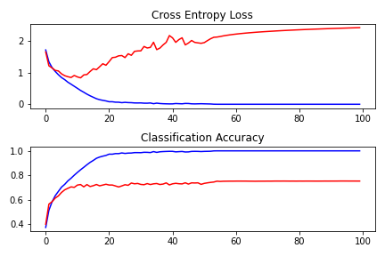
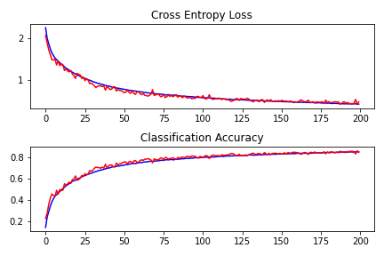
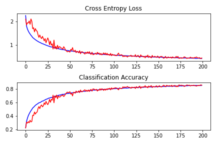
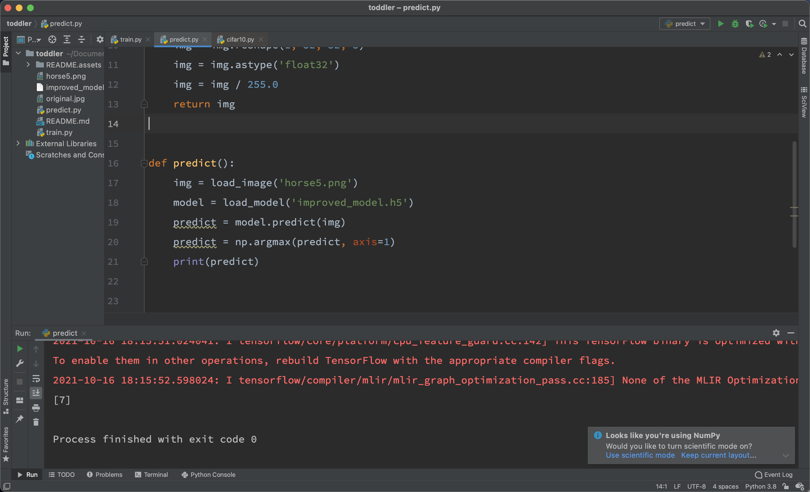

# A course assignment of CNN

#### Background

​	This is a course assignment of Artificial Intelligence Safety. Since I have never get in touch with developing CNN model before, so in this project, I will learn to create a model from scratch. During this process, I will also try explain some of the terms we often use in CNN with my own words. 

​	In this case, we will use CIFAR-10 as our dataset, and VGG as our baseline model.

#### Overview

​	1.Preprocess of CIFAR-10 dataset

​	2.Define, train and evaluate the baseline model

​	3.Deal with overfitting situation

​	4.Deal with instability during learning process

​	5.Make predictions with this model

#### What is CIFAR-10?

​	The CIFAR-10(Canadian Institutue For Advanced Research) is a collection of images that are commonly used to train ML and CV algorithm. The CIFAR-10 dataset contains 60,000 32*32 color images in 10 different classes. The 10 different classes are airplanes, cars, birds, cats, deer, dogs, frogs, ships, trucks. Each class contains 6000 images. 

If you want more information, please check CIFAR-10's website down below.

https://www.cs.toronto.edu/~kriz/cifar.html

#### Preprocess of CIFAR-10 dataset

##### 	1. Load CIFAR-10 dataset

​		In this case, we will use the Keras API to load the CIFAR-10 dataset. 

​		`from tensorflow.keras.datasets import cifar10`

​		The dataset has already splited the data into training data and test data for us, we can load the data in 		this way.

​		`(trainX, trainY), (testX, testY) = cifar10.load_data()`

​		Then we need to convert t

​		`trainY = to_categorical(trainY)`

​		`testY = to_categorical(testY)`

##### 	2. Normalize the data

​		`data_norm = data.astype('float32')`

​		`data_norm = data_norm / 255.0`

#### Define, train and evaluate the baseline model

##### 	1. Define model

​		In this example, we choose VGG as our baseline model. It is comprised of 4 VGG blocks. In each block, there are two Conv layers and one MaxPooling layer.  Each layer will use ReLU activation function and  He weight initialization. This part of model is called feature detector, it will ouput feature maps. Thn we need to flatten the feature map. After that, we can interpret them with one or more fully connected layers,  and then output a prediction.  The architecture defined in Keras as follows:

```
model = Sequential()
model.add(
    Conv2D(32, (3, 3), activation='relu', kernel_initializer='he_uniform', padding='same', input_shape=(32, 32, 3)))
model.add(Conv2D(32, (3, 3), activation='relu', kernel_initializer='he_uniform', padding='same'))
model.add(MaxPooling2D((2, 2)))
model.add(Conv2D(64, (3, 3), activation='relu', kernel_initializer='he_uniform', padding='same'))
model.add(Conv2D(64, (3, 3), activation='relu', kernel_initializer='he_uniform', padding='same'))
model.add(MaxPooling2D((2, 2)))
model.add(Conv2D(128, (3, 3), activation='relu', kernel_initializer='he_uniform', padding='same'))
model.add(Conv2D(128, (3, 3), activation='relu', kernel_initializer='he_uniform', padding='same'))
model.add(MaxPooling2D((2, 2)))
model.add(Conv2D(256, (3, 3), activation='relu', kernel_initializer='he_uniform', padding='same'))
model.add(Conv2D(256, (3, 3), activation='relu', kernel_initializer='he_uniform', padding='same'))
model.add(MaxPooling2D((2, 2)))
model.add(Flatten())
model.add(Dense(128, activation='relu', kernel_initializer='he_uniform'))
model.add(Dense(10, activation='softmax'))
```

##### 	2. The accuracy of baseline model

​		The accuracy is around 75.0% on average. However, we can see that there are few problems during the training process. First, the overfitting problem, we can observe an drastic overfitting around 10-20 epochs.

Second, the instablility during learning. We will apply some approaches and techniques to address this.



#### Deal with overfitting situation

​	It must be pointed out that there are many approaches could handle the overfitting problem. However, in this case we will solve the problem by combining Dropout Regularization and Data Augmentation.

 1. ##### Dropout Regularization

    Dropout means that it will randomly drop nodes out of the network, so the rest nodes need adapt to the slack of the removed nodes. We can easily achieve this by adding a dropout layer in keras.layers.

    ```
    model.add(Dropout(0.3))
    ```

 2. ##### Data Augmentation

    Data Augmentation is a approach that will make copies of the examples in the training dataset with small random modifications, including horizontal flip, minor shifts, zooming, cropping. In this case we will do a little shift on both width and height and do horizontal flip on the images as well. We can achieve this by using the ImageDataGenerator in Keras.

    ```
    data_generator = ImageDataGenerator(width_shift_range=0.1, height_shift_range=0.1, horizontal_flip=True)
    train_iterator = data_generator.flow(trainX, trainY, batch_size=64)
    steps = int(trainX.shape[0] / 64)
    logs = model.fit(train_iterator, steps_per_epoch=steps, epochs=200, validation_data=(testX, testY),
                                  verbose=0)
    ```

3. ##### The accuracy of baseline model + Dropout Regularization + Data Augmentation

   After adding Dropout Regularization and Data Augment, the accuracy of new model reached around 85%, we can see that the overfit problem has been well solved.

   

#### Deal with instability during learning process

##### 	1.  Batch Normalization

​	Batch normalization is a technique designed to automatically standardize the inputs to a layer in a deep 	learning neural network. It has the effect of dramatically accelerating the training process of a neural 	 	network.  We can achieve this by using the BatchNormalization in Keras.

​	`model.add(BatchNormalization())`

##### 	2. The accuracy of last model + Batch Normalization

​	The final model's accuracy reached 86%. So we can save this model and use it for further predictions.

​		

#### Make predictions with this model

 1. Load image

    ```
    def load_image(filename):
        img = load_img(filename, target_size=(32, 32))
        img = img_to_array(img)
        img = img.reshape(1, 32, 32, 3)
        img = img.astype('float32')
        img = img / 255.0
        return img
    ```

2. Load model

   ```python
   model = load_model('improved_model.h5')
   ```

3. Make predictions

   I use a image from the CIFAR-10's website, and try to predict it with our final model. The image looks like this. Apparently, it is a horse, the corresponding class number is 7.

   

   ```
   predict = model.predict(img)
   predict = np.argmax(predict, axis=1)
   ```

   

   As shown in the picture, the model gives the correct prediction.

